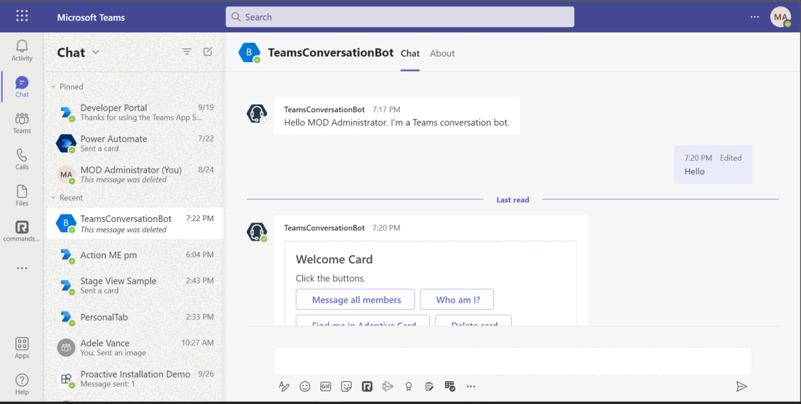
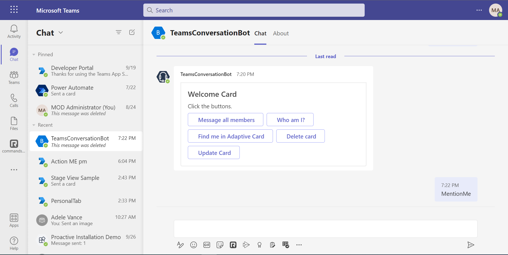
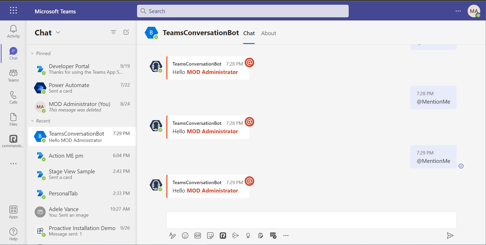
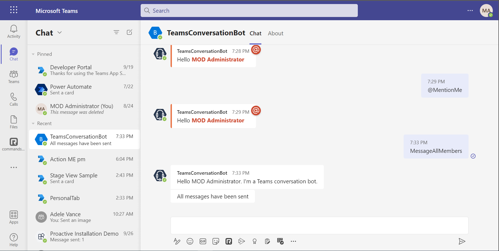

# Teams Conversation Bot

Bot Framework v4 Conversation Bot sample for Teams ([Messages in bot conversations](https://learn.microsoft.com/microsoftteams/platform/bots/how-to/conversations/conversation-messages?tabs=dotnet)).

This bot has been created using [Bot Framework](https://dev.botframework.com). This sample shows
how to incorporate basic conversational flow into a Teams application. It also illustrates a few of the Teams specific calls you can make from your bot.

## Included Features
* Bots
* Adaptive Cards
* Teams Conversation Events
* Immersive Reading Support for Cards

## Interaction with bot


## Try it yourself - experience the App in your Microsoft Teams client
Please find below demo manifest which is deployed on Microsoft Azure and you can try it yourself by uploading the app package (.zip file link below) to your teams and/or as a personal app. (Sideloading must be enabled for your tenant, [see steps here](https://docs.microsoft.com/microsoftteams/platform/concepts/build-and-test/prepare-your-o365-tenant#enable-custom-teams-apps-and-turn-on-custom-app-uploading)).

**Teams Conversation Bot:** [Manifest](/samples/bot-conversation/csharp/demo-manifest/bot-conversation.zip)

## Prerequisites

- Microsoft Teams is installed and you have an account
- [Python SDK](https://www.python.org/downloads/) min version 3.6
- [ngrok](https://ngrok.com/) or equivalent tunnelling solution


## To try this sample

> This sample can be easily local debugged and run with Teams Toolkit in VS Code.

1) Clone the repository.

2) Install dependencies by running ```pip install -r requirements.txt``` in the project folder.

3) If you have already installed `Teams Toolkit` in VS Code, then just run `F5` to start local debugging. Or you can follow this [doc](https://github.com/frankqianms/bot-conversation-py#to-try-this-sample) to run the bot.

## Interacting with the bot

You can interact with this bot by sending it a message, or selecting a command from the command list. The bot will respond to the following strings. 

1. **Show Welcome**
  - **Result:** The bot will send the welcome card for you to interact with
  - **Valid Scopes:** personal, group chat, team chat
2. **MentionMe**
  - **Result:** The bot will respond to the message and mention the user
  - **Valid Scopes:** personal, group chat, team chat
3. **MessageAllMembers**
  - **Result:** The bot will send a 1-on-1 message to each member in the current conversation (aka on the conversation's roster).
  - **Valid Scopes:** personal, group chat, team chat

You can select an option from the command list by typing ```@TeamsConversationBot``` into the compose message area and ```What can I do?``` text above the compose area.

## Running the sample

The bot initialization message


The bot will send the welcome card for you to interact with


The bot will respond to the message and mention the user


The bot initialization message


## Deploy the bot to Azure

To learn more about deploying a bot to Azure, see [Deploy your bot to Azure](https://aka.ms/azuredeployment) for a complete list of deployment instructions.

# Further reading

- [Bot Framework Documentation](https://docs.botframework.com)
- [Bot Basics](https://docs.microsoft.com/azure/bot-service/bot-builder-basics?view=azure-bot-service-4.0)
- [Azure Bot Service Introduction](https://docs.microsoft.com/azure/bot-service/bot-service-overview-introduction?view=azure-bot-service-4.0)
- [Azure Bot Service Documentation](https://docs.microsoft.com/azure/bot-service/?view=azure-bot-service-4.0)
- [Messages in bot conversations](https://learn.microsoft.com/microsoftteams/platform/bots/how-to/conversations/conversation-messages?tabs=dotnet)

